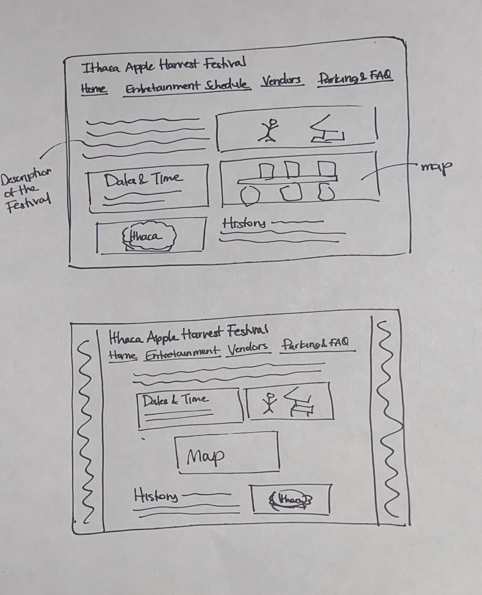

# Project 2: Design Journey

**For each milestone, complete only the sections that are labeled with that milestone.** Refine all sections before the final submission.

You are graded on your design process. If you later need to update your plan, **do not delete the original plan, leave it in place and append your new plan _below_ the original.** Then explain why you are changing your plan. Any time you update your plan, you're documenting your design process!

**Replace ALL _TODOs_ with your work.** (There should be no TODOs in the final submission.)

Be clear and concise in your writing. Bullets points are encouraged.

**Everything, including images, must be visible in _Markdown: Open Preview_.** If it's not visible in the Markdown preview, then we can't grade it. We also can't give you partial credit either. **Please make sure your design journey should is easy to read for the grader;** in Markdown preview the question _and_ answer should have a blank line between them.

## Understanding Users (Milestone 1)

**Make the case for your decisions using concepts from class, as well as other design principles, theories, examples, and cases from outside of class.**

You can use bullet points and lists, or full paragraphs, or a combo, whichever is appropriate. The writing should be solid draft quality but doesn't have to be fancy.

### User Interview Questions (Milestone 1)
> Plan the user interview which you'll use to identify the goals of your site's audience.
> You may use the interview template below and revise it as much as you desire.
> You are **required to author 3 of your own questions**.

**User Interview Briefing & Consent:** Hi, I am a student at Cornell University. I'm currently taking a class on web design and for a project, I am re-designing the website for Ithaca's Apple Harvest Festival. I'm trying to learn more about the people that might use this site. May I ask you a few questions? It will take about 10 minutes. You are free to quit at any time.

(These questions assume you are interviewing a festival attendee at the festival. If you didn't attend the festival, you may revise the questions and instead ask the participant to recall the last festival/event they attended. Do not ask them to speculate about visiting the Apple Harvest Festival. User speculation provides biased data.)

1. Please tell me a bit about yourself. You may omit any personal or private information.

2. What brought you to visit the Apple Harvest Festival today?

3. Before you came to the festival today, did you seek out any information about the festival before getting here?
3a. If yes, What information were you specifically looking for? Did you find it? How did you access that information?

4. When you arrived at the festival, did you seek out any information about the festival?
4a. If yes, What was that information? How did you obtain it?

5. Now that you're here participating in the festival, have you sought out information about the festival?
5a. If so, what was that information?

6. If you did seek any information throughout the day, how did you obtain it?
6a. If you did obtain information, was the information truthful and accessible?
6b. Has that information been a valuable resource while youve been here?

7. As you are exploring the festival, are you looking for anything in specific?
7a. If you what are you looking for? Have you been able to find it?

8. Recall any other festival youve been to other than the Apple Harvest Festival, how did you decide what to do?
8a. (If the user hasnt gone to any other festival) Did you have any expectations before arriving?
8b. If so, did you seek out any information about that festival? If so what information?

9. Have there been any websites you found useful to find information about their Festival?

10. What haven't I asked you today that you think would be valuable for me to know?

**After the interview:** This was really helpful. Thank you so much for agreeing to speak with me today. Have a great day!

### Interview Notes (Milestone 1)
> Interview at least 3 people from your audience. Take notes and include those notes here. Make sure to include a brief description of each interviewee.
> **Copy the interview questions above into each interviewee section below.**
> Take notes for each participant inline with the questions.

**Interviewee 1:**

The first person that I interviewed was from Long Island and had moved to Philadelphia a few years back. Dave and his wife were visiting his son and his family in Ithaca for the weekend.

2. What brought you to visit the Apple Harvest Festival today?
   - They have been coming every year for the past 5 years
   - Dave said its one of his favorite weekend of the year
     - (I asked him what about the festival) The food was the main reason why they kept coming back to vist during this time. He also told me that this event marks the start of fall for him and his family.

3. Before you came to the festival today, did you seek out any information about the festival before getting here?
3a. If yes, What information were you specifically looking for? Did you find it? How did you access that information?
   - Yes, the information that they were seeking is the Garage/Parking instructions as well as the cost for parking
   - They found the parking information at the Ithaca Harvest Festival website

4. When you arrived at the festival, did you seek out any information about the festival?
4a. If yes, What was that information? How did you obtain it?
   - Because they had been coming to the festival for some years now they were pretty familiar with how it was going to look

5. Now that you're here participating in the festival, have you sought out information about the festival?
5a. If so, what was that information?
   - Dave told me he had to ask various vendors where the mac n cheese stand was since he couldnt find the stand

6. If you did seek any information throughout the day, was it accurate and accessible?
   - Apart from the parking information, and a few questions to local vendors they didnt seek much more information

7. As you are exploring the festival, are you looking for anything in specific?
7a. If you what are you looking for? Have you been able to find it?
   - Food was the primary thing that Dave and his wife where here to get and again they had to ask for directions to find the specific food stand they were searching for.

8. Recall any other festival youve been to other than the Apple Harvest Festival, how did you decide what to do?
8b. If so, did you seek out any information about that festival? If so what information?
   - This is the main festival they come to every year. Dave mentioned going to their state fair once or twice with his grandkids. He obtained information about the state fair through the local councils website and was specifically looking for the time that the state fair opened.

9. Have there been any websites you found useful to find information about their Festival?
   - They used the Ithaca Apple Harvest Festival website along with the Visit Ithaca website

10.  What haven't I asked you today that you think would be valuable for me to know?
    - He thinks more people should come and visit Ithaca just to try the food at the Apple Harvest Festival.

**Interviewee 2:**

The second person I interviewed was Marcus. Marcus is a Cornell Alum who graduated a few years ago and decided to visit Ithaca, this time bringing his wife, to see his old campus and enjoy the Apple Harvest Festival

1. What brought you to visit the Apple Harvest Festival today?
   - He hadnt been in really long and wanted to bring his wife to see where he went to college and what activities he used to do when he was studying here

2. Before you came to the festival today, did you seek out any information about the festival before getting here?
3a. If yes, What information were you specifically looking for? Did you find it? How did you access that information?
   - The main information they wanted to get was the times of the festival along with the directions of where to park and how much the parking would cost
   - They found this information in the Ithaca Apple Harvest Festival Website

3. When you arrived at the festival, did you seek out any information about the festival?
4a. If yes, What was that information? How did you obtain it?
   - Marcus wanted to get a map of where the different vendors where located but he didnt know where to find it.
   - He told me he thought there would be people giving out some maps and information about the events

4. Now that you're here participating in the festival, have you sought out information about the festival?
5a. If so, what was that information?
   - Not really

5. If you did seek any information throughout the day, was it accurate and accessible?
   - Mainly asked other people walking around, specially if they were carrying a plate of the food that they were looking for

6. As you are exploring the festival, are you looking for anything in specific?
7a. If you what are you looking for? Have you been able to find it?
   - The Apple Cider Doughnuts
   - There is a big sign and its right at the beginning of the stands so not that hard to miss

7. Recall any other festival youve been to other than the Apple Harvest Festival, how did you decide what to do?
8a. (If the user hasnt gone to any other festival) Did you have any expectations before arriving?
8b. If so, did you seek out any information about that festival? If so what information?
   - Marcus mentioned that they were planning to go to a Cheese festival on their way back to New York City and that they had found out the information about this festival through a mutual friend who had posted about it on their Instagram

8. Have there been any websites you found useful to find information about their Festival?
   - They used the Visit Ithaca website to find the dates of the Apple Harvest Fest

9. What haven't I asked you today that you think would be valuable for me to know?
    - Marcus told me that he wishes there would be a way to see what vendors would be at the festival in sort of categories (all the food vendors, jewelry, cider, apples...etc)

**Interviewee 3:**

Miranda has lived in Ithaca all her life. She actually works in Cornell and has been coming to Apple Fest for a long time.

1. What brought you to visit the Apple Harvest Festival today?
   - "I love the environment and the food that is here"
   - Told me it helps her get in a festive food

2. Before you came to the festival today, did you seek out any information about the festival before getting here?
3a. If yes, What information were you specifically looking for? Did you find it? How did you access that information?
   - She mentioned that Cornell provided information about the logistics of the Festival and thats were she got most of the information that she was looing for.
   - Specifically looking for the activities throughout the weekend and the different performances that would be showcased.

4. When you arrived at the festival, did you seek out any information about the festival?
4a. If yes, What was that information? How did you obtain it?
   - Had to ask the people working as traffic control where she could park
   - "No as far as putting information its good because sometimes people dont give you all the information that you need or when it will start"

1. Now that you're here participating in the festival, have you sought out information about the festival?
5a. If so, what was that information?
   - Not really, "we just walked around and explored the festival"

1. If you did seek any information throughout the day, was it accurate and accessible?
   - Miranda told me that finding the information was a bit hard because some of the information that she tried to find had very different answers. She was unsure about the credit card payments as she couldnt really find much information about it.

2. As you are exploring the festival, are you looking for anything in specific?
7a. If you what are you looking for? Have you been able to find it?

8. Recall any other festival youve been to other than the Apple Harvest Festival, how did you decide what to do?
8a. (If the user hasnt gone to any other festival) Did you have any expectations before arriving?
8b. If so, did you seek out any information about that festival? If so what information?

9. Have there been any websites you found useful to find information about their Festival?
   - Havent used website resources

10. What haven't I asked you today that you think would be valuable for me to know?
    - No answer

### Goals (Milestone 1)
> Analyze your audience's goals from your notes above.
> List each goal below. There is no specific number of goals required for this, but you need enough to do the job (Hint: It's more than 1 and probably more than 2).

Goal 1: Find their favorite food vendors

- **Design Ideas and Choices** _How will you meet those goals in your design?_
  - I think I want to make sure to add a map that is easy to find within a website and will allow the audience to make their way through the festival to find the stands that they are interested in easily.
- **Rationale & Additional Notes** _Justify your decisions; additional notes._
  - More than one of the interviewees mentioned how they came to the festival with a specific food item in mind (doughnuts and mac & cheese). If the audience had easier access to a map they could find these stands much easier.
  - I did go through the current website and there is a map available. I think maybe people didnt initially find it on the site or didnt even think to look on the site. With that in mind, making it stand out more in the website would be a good addition to my design.

Goal 2: Being able to find parking in order to enjoy the Apple Harvest Festival

- **Design Ideas and Choices** _How will you meet those goals in your design?_
  - Save a section in the website related to where you can park (with the address) and the prices of the parking
  - Since all the interviewees mentioned it, it should be easy to find on the website. Maybe even in the first page
- **Rationale & Additional Notes** _Justify your decisions; additional notes._
  - This is definitely the information that all of my interviewees actually had to go online to search. If they want to accomplish their goal to go to the festival they first need to be able to find parking in the area. Since this part is critical to the whole experience of the festival I think its an important goal to keep in mind.
  - While the audience I interviewed all drove to the festival, other transportation should also be included in the design of the website to make sure the festival is accessible to all.

Goal 3: Explore more local vendors

- **Design Ideas and Choices** _How will you meet those goals in your design?_
  - Include a lot of content of the different vendors that will be at the Ithaca Apple Harvest Festival
  - As one of the interviewees mentioned, have it organized by categories so that people can look for the type of small business they might be interested in supporting
- **Rationale & Additional Notes** _Justify your decisions; additional notes._
  - A lot of the vendors at the Ithaca Apple Harvest Fest are small local shops or farms. People coming to the festival, especially people from out of town, want to explore what products these vendors sell. It is important to implement this into the design because it is a large part of my audiences experience.

Goal 4: Learn about event activities

- **Design Ideas and Choices** _How will you meet those goals in your design?_
  - Include section of the different events activities and the times of the events
  - I think this could possible be its own section in the website
- **Rationale & Additional Notes** _Justify your decisions; additional notes._
  - While the Apple Harvest Festival has a lot of people going for the food, most of the interviewees also mentioned the activities and festive environment. I think that it is important to show that through the design and provide information about these activities

Goal 5: Find information fast and easily on mobile devices

- **Design Ideas and Choices** _How will you meet those goals in your design?_
  - My website has to be a responsive design
- **Rationale & Additional Notes** _Justify your decisions; additional notes._
  - Most people that go to the festival and seek to find information will probably do so with their phones. The website has to be made with mobile users in mind, not only desktop users.

### Audience (Milestone 1)
> Briefly explain your site's audience.
> Be specific and justify why this audience is a **cohesive** group with regard to the Ithaca Apple Harvest Festival. .

My sites audience are Ithaca visitors who are interested in going to the Ithaca Apple Harvest Festival.

Most of the people that I interviewed were people who visit Ithaca frequently and have already gone to The Apple Harvest Festival once but arent necessarily experts on the events and the Ithaca Commons Area. This is a cohesive group because they are people who already know about the festival, but will likely have to do some research and seek information before and during the festival. They also differ from residents or students in that they arent locals in the area and will most probably seek other types of information about other things to do in Ithaca when they visit, not just about the Festival. I think this audience is also a cohesive group because they will have similar goals of finding vendors they are interested in, exploring the local businesses, and engaging in other community activities.

## Festival/Event Website Design Exploration (Milestone 1)

Identify three festival or event websites (preferably static websites) that exist today on the web. You will be drawing inspiration from these sites for your own site; please select websites that are similar to the website you wish to create.

Include two screenshots of the home page for each site: narrow and wide.

**We'll refer to these are your "example websites."**

1. <https://villagesofvanburen.com/special-events/scenic-drive-festival.html>

    

    

2. <https://thorntownfestival.org/>

    

    

3. <https://www.mainepumpkinfest.com/>

    

    

### Festival/Event Website 1 Review (Milestone 1)
> Review the website you identified above. (1 paragraph)
> In your review, include a discussion common design patterns in the site.

The first website has information about the Scenic Drive Festival. It includes a lot of information about the festival, and highlights the important logistical information such as the time right on the homescreen. It also has a large amount of navigation buttons so that users can look for the information that they need. These buttons include Places to Eat and Drink, Places to Stay, Shop, Fun Things to Do and a Contact. However, on the mobile site, these buttons not implemented and instead there is text describing the events happening each day. While the mobile site still has a lot of good information, I think the desktop site does a better job at providing easy access to information the users may want like where to eat and what there is to do at the festival. Common design patterns throughout the site include the visible navigation bars and images of festival throughout. The navigation bar is important because its how the user will be able to move through the site. However, this page has a lot of links. It has a top navigation bar, and another similar one on the right panel of the page. I think this might be because there are different events in the site other than the festival, so the side navigation might be just about the festival. However, this can be confusing to users who dont make that distinction and end up going to the wrong page. The use of pictures also provides more information about what the festival looks like and what they the audience may see.

### Festival/Event Website 2 Review (Milestone 1)
> Review the website you identified above. (1 paragraph)
> In your review, include a discussion common design patterns in the site.

This website is the Festival of he Turning Leaves website. While this website does not look very modern and nice, I think its a great model to follow because of how the content is split up. This home page is definitley an introductory site that features all of the different links to pages that have other content. There is a navigation panel on the left side which includes pages such as the different days of events, directions and vendors. Common design patterns include a navigation bar that is emphasized visually, in this case it has a different color that contrasts with the rest of the page. The mobile version of the site actually doesnt change at all. It is simply a zoomed out version of the desktop website. This is an example of website that does not have a responsive design. There is no change or adaptation to the more narrow view. It is definitely less accesible because if you need to make the text bigger it is hard to nevigate and move through the site (you have to swipe horizontally) I think this page was definitely designed for desktop use only.  However because this content is organized in an effective way, the mobile site is not that hard to use.

### Festival/Event Website 3 Review (Milestone 1)
> Review the website you identified above. (1 paragraph)
> In your review, include a discussion common design patterns in the site.

This website has information on the Damariscotta Pumpkin Fest and Regatta. The home page of the website includes a few images, a navigation bar, the time schedule of the festival and directions/shuttle services. The content on the first page makes this website stand out because I think this infomation should be readily available for audiences to find. It has a main navigation section in the upper left corner of the page. I would say this navigation structure is not very familiar since its just in a corner of the page. However, the navigation through the site is very easy because the pages are labeled in a logical way. The mobile website has the same content and organziation as the desktop version, with the difference of a dynamic hamburger navigation bar instead of the static one seen in the desktop website. Something I found from this website that I liked a lot is that the most of the pictures link directly to their instagram page. I think this adds to the website because if people want to see more pictures of the event they can view them directly in the events instagram.

## Content Planning (Milestone 1)

Plan your site's content.

### Your Site's Planned Content (Milestone 1)
> List **all** the content you plan to include your personal website.
> You should list all types of content you planned to include (i.e. text, photos, images, etc.)

- Apple Harvest Festival Introduction (what it is)
  - Photos of the festival (cider apples stand)
- Dates and Time of the Festival
- FAQ section
  - how much money, credit card, best time to attend, alcohol
- History of the Festival
- Entretainment Schedule
- Directions
  - Include the map of how to get to the Commons
  - Picture of the Commons
  - Link to the TCAT service
- Some Vendors of different categories (Produce, Cider, Food, Crafters)
  - Pictures of each kind (caramel apples, doughnuts, apple wines, craft jewelry, apple bins)

### Content Justification (Milestone 1)
> Explain (about a paragraph) why this content is the right content for your site's audience and how the content addresses their goals.

Using the audiences goals that I identified above, I selected which content would primarily address these goals. My audience will want to find the vendors that they are interested in buying from, to do that I want to make sure the content includes a map of the distribution of the festival and a list of the different vendors that will be present. This will also satisfy the goal of learning about new vendors because the audience will be able to identify new local businesses they are interested in from the list and then find their stand while at the festival. Another big goal for my audience is being able to get to the festival and parking without a problem. I will have to include some content relating to the address and the parking instructions, and also the bus details for those arriving through public transport. Because my audience is comprised of frequent visitors who will want to participate in the activities and entretainment, I will also include the schedule of these activities. Additionally, I want to include the logistical content that the people I intervieweed mentioned they had to search up the most, like the time, dates and payment instructions. This content will be able to address the goals that frequent visitors of Ithaca may have when coming to the Ithaca Apple Harvest Festival.

## Information Architecture (Milestone 1)

### Content Organization (Milestone 1)
> Document your **iterations** of card sorting here. You must have at least 2 iterations of card sorting.
> Include photographic evidence of each iteration of card sorting **and** description of your thought process for each iteration.
> Please physically sort cards; please don't try and do this digitally.

 
 For the first card sort I wanted to just put each type of content that fit in the same category. I put all the vendors together because I think it makes sense to have all the information about the vendors in a compiled area of the website. I also grouped the dates and the event explanation together because I feel like they are the pieces of information that people most likely want to see first. I think that when you are going to an event the first things you need to know are the dates and what the event is. Having these, the other content didnt really fit into any categories with eachother so I think they would have to have their own page.
 
 For the second iteration, I built upon the previous iteration but thought about seperating content in what type of information the content holds. For example, most of the interviewees mentioned that they needed to search up the transportation and parking information as well as how the payment works. These are commonly asked questions that could be grouped together to make up a page that includes all the information users may need. Additionally, I added the history of the festival to the dates and introductory message since it is the 40th annual Apple Harvest Festival. I think having this information in the main part of the page would show my audience how important this event is to the Ithaca community.
 
 For the last iteration I tried, I wasnt really sure how else I could organize the content. I went back to the list of content I had and I decided that I might want to add maps for the transportation. To do so, I think the FAQ section would get lost so maybe these two content pieces should be separated into a seperate page.

### Final Content Organization (Milestone 1)
> Which iteration of card sorting will you use for your website?

I am planning to use the 2nd iteration

> Explain how the final organization of content is appropriate for your site's audiences.

My audience is Ithaca vistors who may not be so knowledgable about the festival and the Ithaca area. My main objective is to organize the content in a way that will be easy for them to find the information that they are seeking. First, having the information about the event and its history on the first page will invite more visitors to Ithaca. They may learn about the festival and how important it is to the Ithaca community. They will also find the most important information which is the dates and time. Once the visitors decide to come, they will have further questions which they can resolve by going to the FAQ page. The visitors will most likely want to learn more about the vendors and a page that summarizes all the vendors will help the visitors find information on them easily. Lastly, an event schedule is important and I think having its own page allows the vistors to see the events as something additional to their stay in Ithaca.

### Navigation (Milestone 1)
> Please list the pages you will include in your website's navigation.

- Home
- Entretainment Schedule
- Vendors
- FAQ and Transportation

> Explain why the names of these pages make sense for your site's audience.

Because my audience are people from out of town, I wanted to make sure that the pages all had a title that would give enough information on what the users can find if they click on it. Particularly, I labeled one of them "Parking and FAQ" because Parking seemed to be the piece of information that was most sought after. I wanted to make sure that individuals could easily access this information.

## Visual Theme (Milestone 1)
> Discuss several (more than two) ideas about styling your site's theme. Explain why the theme ideas are appropriate for your target audiences. Note the theme you selected for your site and why it's appropriate for the audience and their goals.

One theme for the styling of my site is a red apple theme. I was thinking I could create a monocolor look throughout my whole website of different reds to really emphasize the apple theme of the festival. I think the theme is appropriate because it is congruent with the actual events theme.

Another theme I was considering is a fall festive theme. The two vistors that I interviewed both mentioned that one of the reasons that they came was because of the festive fall mood that the event has. I think playing on the emotions of the actual event and incorporating that into the theme will attract a lot of potential visitors who would want to do a fun festive activity to start their fall.

A good theme might also be an apple tree design. I think I could implement a website inspired by an apple tree. I would be able to use red, green and brown as the main colors of my website.

The theme that I am going to be using is the fall festive theme. I want to use autumnal colors throughout the pages. I think colors are the main way that I will implement this. Along with this color theme, I definitely want to make the font more playful and informal since this not a professional setting but rather a fun family event. I chose this theme because thorughthe interviews a lot of people mentioned the festive mood of the festival and I think that continuing with this already present emotion, it is valuable to build on it and make the website match the events mood and theme.

## Design (Milestone 1)

Document your site's layout.

### Layout Exploration (Milestone 1)
> Iterate on your site's design through sketching.
> Sketch both the narrow and wide versions of the site.
> Here you are just exploring your layout ideas. You don't need to sketch every page.
> Provide an explanation for each sketch explaining the idea and the design patterns you are leveraging.

In sketching the narrow sketches, I tried to explore the different ways that I could stack the content in both a useful and appealing way. The first sketch that I did was the one on the left. I started by making a vertical navigation bar which is familiar to narrow screens. I placed the Dates and Time first because I saw that in my interviewees that was often the first thing that people wanted to know about the event. I decided to place a picture next to it, but upon finishing the skecth I think that might be too much horizontal content to for the narrow screen. However, the text portion isnt very busy either so I am still a little unsure whether this part of the design could look good or not on a narrow screen. Building on that, on the second sketch, I wanted to focus on the vertical aspect of narrow websites. I knew I wanted to include a map on the home page, and because the map has some purpose other than decoration, I decided to make it span the whole width of the site. I kept most of the content stacked vertically to avoid horizontal scrolling.

After sketching the narrow versions, I looked an the content and started brainstorming how I could design the desktop site to take advantage of the horizontal space. For the first one, I ended up designing a sort of grid looking page in which everything was in boxes side by side. I thought that this alignment would look really well on the site and would section of each piece of information neatly. I also made sure to incorporate pictures into this since I want my audience to see what the event looks like and get excited to attend.
For the second sketch I wanted to break up the grid that I had previously thought about and section of the different content by type. The main decision that I took is that I wanted the map to be as accesible and visible to users so I wanted to make sure that the map took up quite a bit of space in the screen.

### Final Design (Milestone 1)
> Include the final sketches for each of your pages.
> The sketches must include enough detail that another 1300 student could implement them.
> Provide an explanation for each sketch.

**Narrow (Mobile) Design:**

I took my observations for the first few sketches that I made and combined the things I thought were particularly good. There is a vertical navigation bar as this is what is familiar for narrow screens. I also chose to place all of the content vertically on top of eachother because I want to avoid any horizontal scrolling, or too much in one horizontal line that may look squished.

Home:I did put to images next to each other because they are purely for decorative purposes. I think its important to have a few images on the home site so that visitors can see what the event looks like, but I also didnt want all of the text information to be lost between a bunch of pictures. I think this is a risk that I will have to explore when Im actually implementing the site, but I think that the side by side pictures will not disrupt the design patterns of a narrow screen because they are mostly decoration. I also chose to have the map take up the whole width because (unlike the other pictures) this visual element provides important content for my audience. I found through interviews that it wouldve been useful for people to have a map of the event in order to find certain vendors more easily. In order to meet this goal the map must be big enough for users to use on the day of the event.

Vendors: I structured the content in the page so that each type of vendor would have its seperate "box". This way the audience can find which type of vendor they are interested in and find out their options. I will have these vendor boxes stacked vertically to follow the narrow screen design patterns and will include some pictures for decorative purposes.

Entretainment: Again, using design patterns of narrow screens. The content will be structures vertically stacking with the addition of some images.

FAQ and Transportation: I decided to categorize each type of question into subdivisions. I will structure these questions similarly to the other pages in which I will stack each "box" on top of each other. I will also make each box different colors to be able to distinguish each type of topic. I think this is useful because it wont just look like a list of questions and answers that could be difficult to navigate through.

**Wide (Wide) Design:**

The wide screen sketch of the website is a more complex implementation of what the narrow website is. Using design patterns we know, the navigation bar will no longer be vertical but rather it will be horizontal through the page. Additionally, I added more images inline with the text as horizontal scrolling is not an issue in this display.

Home page: I did keep the order of the content the same because I think that the order is important to meet the goals of the audience, so I made sure to put the most important elements like the dates and time at the top. Similarly to the narrow design, the map will take up a large portion of the width because I want it to be accesible for users.

Vendors: Unlike the narrow design, for the wide design I want to organize each type of vendors in columns. This will make use of the horizontal space in the website.

Entretainment: The entretainment page will be structures with columns in the wide format to use up the horizontal space and avoid a lot of negative space that would look weird.

FAQ and Transportation: This section is the most similar to the narrow version. I want to keep both versions as similar as possible so that users that might initially see it on a laptop will not get confused when they see it on their phones. While I will continue to stack vertically, the text can span horizontally as well. I think I will test during the implementation the use of margins and alignment so that the wide version isnt just sentences spanning the whole horizontal width.

**FINAL SUBMISSION CHANGE** Like I initially predicted, my original design for the wide screen made this page look like sparse lines of text. In the final implementation I modified my original idea and put the different FAQ segmentes next to each other. I think this change in the design makes the page look more intentional and organized.

### Design Rationale (Milestone 1)
> Explain why your design is appropriate for your audience.
> Specially, why does your content organization, navigation, and site design/layout meet the goals of your users?
> How did you employ **design patterns** to improve the familiarity of the site for your audience?

The design is appropriate for the user because it makes sure to highlight and make visible the information that they will most likely seek. Using the knowldge from the interviews, users will most likely look at the website for the dates and time of the event. Thats why I wanted to put the date and time at the beginning of the website so that the audience can find that information easily. Additionally, the map is another component that meets the audience's goals so it must be visible enough so that the audience can extract information from the map. Additionally, because my audience is vistors from outside the Ithaca area, I decided to add pictures throughout the design that would give possible vistors more information about how the event looks like.

I employed various design patterns to improve the familarity. The most noticeable is the navigation bars. For the narrow screen, the navigation bars are vertical whereas on the wide screen they are horizontally organized. This is a design pattern that is already familiar to users. I also sturctured the content with different orientations. The narrow screen has each element vertically stacked to take advantage of the vertical scrolling that the users already have. Avoiding horizontal scrolls is an important for responsive design because it is not common to scroll sideways when looking at a website on your phone, in doing so the user wont be familiarized with how the page works.

## User Testing (Final Submission)

### User Testing Tasks (Final Submission)
> Plan out your user testing tasks before doing your user testing.
> These must be actual user testing tasks.
> **Tasks are not questions!**

1. Identify an Apple Cider Vendor

2. Describe how to park your car at the festival

3. Find out if you can pay with credit card

4. Locate the shows location

5. Identify 3 Produce vendors

6. Locate event schedule

7. Find the time of the Viva Mayhem Preformance

8. Lets say you have never been to Ithaca before and you are unsure what is the attire for the festival, find what clothes you should wear.

9.  You have been seperated from you friend at the festival but she told you she is by the carnival rides, locate a resource that you could use to find her.

### Participant 1 (Final Submission)
> Using your notes from above, describe your user by answering the questions below.

1. Who is your user, e.g., where does the user come from, what is the user's job, characteristics, etc.?

    I interviewed a woman who was touring the Cornell campus with her family. Shes originally from Rochester NY. She is a mother of two kids, the oldest one is hoping to attend Cornell.

2. Does the user belong to your audience of the site?

    > If “No”, what’s your strategy of associating the user test results to your audience’s needs and wants? How can your re-design choices based on the user tests make a better fit for the audience?

    I think this is definitely a good fit. My audience are people visiting Ithaca. I think parents of students fits quite well into the category because when they visit they might want to do something fun with their children like go to the apple fest. Additionally,

### Participant 1 -- Testing Notes (Final Submission)
> When conducting user testing, you should take notes during the test.

- Directly knew how to find the apple vendors and produce vendors. I did see her have to zoom into the page to read them out (A bigger font size may be necessary)
- Parking information was found easily because of the navigation bar saying transportation
- user took some time to find the venue of the entretainment even if they were in the entretainment page- its a small sentence so it might get lost with the other content
- Found the attire information fast again with the FAQ
- The user knew to look for a map (last task) but took a significant amount of time to find where it was. She initially went to the FAQ section to find the map until she finally found it in the Home page.

### Participant 2 (Final Submission)
> Using your notes from above, describe your user by answering the questions below.

1. Who is your user, e.g., where does the user come from, what is the user's job, characteristics, etc.?

    Pedro is a junior studying mathematics in the College of Arts and Sciences. He has never been to the Apple Harvest Festival before.

2. Does the user belong to your audience of the site?

    > If “No”, what’s your strategy of associating the user test results to your audience’s needs and wants? How can your re-design choices based on the user tests make a better fit for the audience?

    This user doesnt exactly meet with the audience given that he could be considered an Ithaca local. He might know more about the area than someone who is visiting out of town. However, the fact that he has never been to the Ithaca Apple Harvest Festival makes this a useful testing since vistors also have that same charactertics. While Pedro is not necessarily my audience, he provides another pespective on a first-timer experience.

### Participant 2 -- Testing Notes (Final Submission)
> When conducting user testing, you should take notes during the test.

- Struggled finding the entretainment schedule. He seemed to think that the whole festival was considered the entretainment. He instead responded with the dates and times of the festival, not the entretainment schedule.
- Found the map without any difficulty
- Found vendors fast
- Pedro was shown the "mobile" version of the web page and he did mention that the font was a bit larger than he was useful
- Accessed the FAQ and transporation page to find the information he was prompted to find.

### Participant 3 (Final Submission)
> Using your notes from above, describe your user by answering the questions below.

1. Who is your user, e.g., where does the user come from, what is the user's job, characteristics, etc.?

    I interviewed Chris. He was another parent that was touring the Cornell Campus with his daughter. He is from New Jersey and works in Finance.

2. Does the user belong to your audience of the site?

    > If “No”, what’s your strategy of associating the user test results to your audience’s needs and wants? How can your re-design choices based on the user tests make a better fit for the audience?

    Chris is definitely part of the audience. Similar to the first user that I tested with, parents of Cornell students fit very well into my audience because they are probably the people that will visit Ithaca the most as their children go to college. In the case they are coming in the fall, they will want to explore the Ithaca area and go to the Ithaca Apple Harvest festival. The information on the website (where to park, how to pay and the event schedule) is information this audience would need to accomplish their goal of going to the festival.

### Participant 3 -- Testing Notes (Final Submission)
> When conducting user testing, you should take notes during the test.

- Identified apple cider and food vendors without difficulty. Went directly to the vendor page to look for that information.
- Found the parking information without difficulty but he did express how he didnt see an address that people could follow (definitely content that I could add to the website because my audience would surely need it)
- Took some time to find the map (mostly since he didnt really scroll in any of the pages)
- Was able to find the FAQ section without difficulty and identify the answers to the payment and attire task.

### Potential Changes Based on User Testing (Final Submission)
> What changes would you make to your design based on user testing?
> Note: You are not required to change your design. Simply tell  us what you would change.

One of the things I would change is to have the transportation page be a different page. While my choice of navigation page title allowed users to find this information easily, the second user I tested with did express that it was a little weird having that information combined with the FAQ. I think having a seperate page and maybe including a map of the area would make my website design a lot clearer. Additionally, my website doesnt explicitly say where the festival is which is a big limitation because my audience will be coming from outside of Ithaca and they might not know where to go once they arrived in the Ithaca area.

I also had a few miscalculations with the font size. I did see users having to zoom in to read some text, but also some mentioning that the smaller screen size text was too big. I think I would change the font size to get to a place where it didnt take away from the experience.

## Rationale (Final Submission)

**This rationale should be polished writing:** one you might submit as a report to a client or boss to help explain the project and convince them you did a good job. You'll be surprised how much writing and communicating you need to do about projects and choices on internships and jobs; practice that here.

It should be a comprehensive, complete story of the project. You might find that each section runs about a paragraph. Sketches can often help tell the story of your design.

Your rationale should be a polished version of the earlier explanations.

### Audience (Final Submission)
> A complete and polished description of the intended audience(s) for your website.

The final audience for my website are individuals who are interested in visiting Ithaca during the fall. At first I thought the audience was frequent Ithaca visitors, but I found that making the cohesive audience Ithaca visitors in general allows my website to be more vestile for the different types of visitors. I chose this audience because it met with the characteristics of most of my user interviews. This audience makes sense for the website because it is a group of people that will have to find information about the Apple Harvest Festival online. Unlike Ithaca locals or students who can get informed through flyers and local news, travelers are forced to rely on the website to find information about the event. Further, by chosing my audience to be people that want to visit Ithaca in the fall time, I was able to find the common goals and produce a website that would tailor to this audiences needs.

### Audience Goals
> Explain how your site's design addresses the goals of the audience.

For this audience, I had a handful of goals to keep in mind in the implementation of the website. Taking information from my user interviews, I came up with 5 goals that were vital to the success of the website. The first goal was that users could find their favorite food vendors. This goal was mentioned various times during the interview. A lot of people travel from out of town specifically for the food at the Ithaca Apple Harvest Festival. Being so, having information about food vendors readily available for users was important in the implementation. Another goal was to find parking and transportation. This was also mentioned in most of the interviews. This is important for the audience because unlike students or locals, they will most probably be arriving at the festival in their personal vehicle. The next goals are exploring local vendors and learning about event activities. These were important to address because the visitors will want to get the full experience of the festival and Ithaca. In order to make their visit meaningful, the website must also supply them with information about local businesses and entretainment. Lastly, because the users will most probably need to access some information once they are already at the festival, the website must be responsive to mobile screen sizes.

### Visual Design (Final Submission)
> An explanation of how the final design is appropriate for your audience.
> Include design patterns in your rationale.

For the design of the website, I tried to combine the thematic elements with common design patterns in order to provide the best experience for the user. I chose the design to be fall colors. While an obvious choice, I think it is justifiably a important choice because of the user interviews. During the interviews, various interviewees mentioned that one of their favorite things about the festival, and one of the reasons they want to go back, is the festive mood. One of them even mentioned it acted as the start of their fall season. Listening to my audience, I thought it was important to use the emotions that the audience already had for the event and translate them into the theme of the website. The color palette is filled with different hues of warm colors, pictures of apples and fall food and informal (sans-serif) fonts to emit the emotion of warmth and coziness that fall is known for.

As for the structural stylistic designs, I took a lot of inspiration from the example websites I investigated as well as design patterns we had talked about in class. This was mostly present in the media queries and responsive design. For the wider screen, I had a horizontal navigation bar and elements were placed side by side. However, for the narrow design, I followed other design patterns. I made the navigation bar vertically stacked so that the buttons wouldnt be squished together. I also vertically stacked the different content to avoid horizontal scrolling. Additionally, the font size is larger to allow for users on smaller screen sizes to enjoy the content comfortable. Some aesthetic design decisions were also implemented with the example websites and class lecture examples, such as the logo as the header in the narrow screen, and a background image for the wider screen. I did add some modifications such as the size and how these elements changed depending on the responsive state. I wanted to implement these elements into the visual design of the website because I thought they really elevated the website as a whole and also added to the theme. For example, the apple backdrop in the wide screen design further emphasizes the festivals theme through the apples and fall colors.

### Self-Reflection (Final Submission)
> Take some time here to reflect on how much you've learned since you started this class. It's often easy to ignore our own progress. Take a moment and think about your accomplishments in this class. Hopefully you'll recognize that you've accomplished a lot and that you should be very proud of those accomplishments!

I think this website was definitely more of a challenge to me than the first. Sketching was the most useful tool during this process, specially when it came to structuring the html. Because I had a rough idea about how the narrow and wide versions would look, I was able to add the divs and structure the content very easily without having to go back and edit the structure a lot. I think it did take me a lot of back and forth when looking at the breakpoints to be satisfied with how the website looked at every width. I also think that having a "real" audience instead of an imagined audience definitely motivated me to prioritize other aspects of the design that I wouldve previously ignored.

## Grading (Final Submission)

### Collaborators
> List any persons you collaborated with on this project.

None

### Reference Resources
> Please cite any external resources you referenced in the creation of your project.
> (i.e. W3Schools, StackOverflow, Mozilla, etc.)

I used the Mozilla Documentation for HTML and CSS elements and format.
<https://developer.mozilla.org/en-US/docs/Web/CSS/Reference>
<https://developer.mozilla.org/en-US/docs/Web/HTML/Element>
